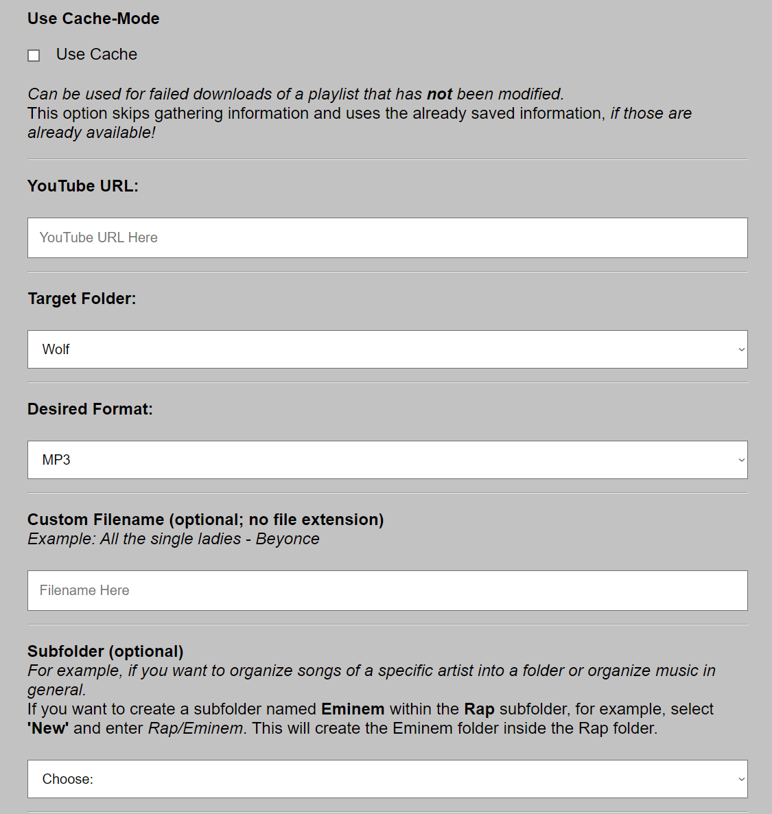

# yt_dlp WebGui

## Description

This is a mostly private project created to simplify adding and managing music on a Linux Server running Emby. It provides a web interface for downloading YouTube videos and playlists, with features tailored for music management.

## Setup

1. Clone the repository:
```
git clone https://github.com/w0lfzk1n/yt_dlp-WebGui.git
cd yt_dlp_webgui
```

2. Install requirements:
```
pip install -r requirements.txt
```


3. (Optional) Run `python manage_app_users.py` to add a new user or change the default password.

*You dont have to add a new user, for local usage you can just use the default `admin` user.*

**Default Credentials:**

- Username: `admin`
- Password: `admin`

- If a new user is added, complete the following steps:
  - Edit the user list in `templates/index.html`. Search for "Admin" and add a new `<option>` for the new user. The `value` must be the username:
    ```
    <select id="folder">
        <option value="admin">Admin</option>
        <option value="newuser">New User</option>
    </select>
    ```

4. Open `data/paths.json` and change the desired `output_path` for the user. Otherwise, it will save the output in the "final_output" folder of the project directory.
    ```
    {
      "folders": {
        "admin": "final_output",
        "newuser": "/Path/To/Your/Output
      }
    }
    ```

6. Use a browser extension to extract cookies for YouTube into a text file:

*You don't have to use cookies, but it is recommended to do so, since youtube will block access when you are flagged as potential bot.*

- See [yt-dlp wiki](https://github.com/yt-dlp/yt-dlp/wiki/Extractors#exporting-youtube-cookies)
- Or use [Get cookies.txt LOCALLY](https://chromewebstore.google.com/detail/get-cookiestxt-locally/cclelndahbckbenkjhflpdbgdldlbecc)
- Save the cookie file as `data/cookies.txt`

6. (Optional) Open `app.py` and change the desired IP and Port. (Make sure you know what you're doing, otherwise it will run on localhost.)

7. Run the application:
```
python app.py
```


8. Browse to the URL and start downloading.

**Note:** You need to have FFMPEG set up on your machine!

**Side-Note:** The Logout and Cancel-Button are just visual ;D They don't work for now.

## Features

- **Single Videos and Playlists:** Supports URLs for both single videos and playlists.
- **Cache:** Retrieved information about videos or playlists is saved in JSON files in the `cache/` folder, allowing for quicker re-runs of failed downloads.
- **Formats:** Supports MP3 and MP4 formats.
- **Sorting:** Allows selection and creation of new folders for output (inside the rootpath in `data/folders.json` for each user).
- **Multiple Users:** Supports multiple users with different output folders in `data/folders.json`.
- **Thumbnails:** Automatically attempts to embed available thumbnails into file metadata.
- **Logging:** Provides log output in a box on the webapp and in the `logs/` folder.
- **Interpret and Album:** Inserts the set output folder name into the metadata as "Interpret" and "Album" to assist with media server sorting.

## Screenshots





## Disclaimer

There are more feature-rich and actively maintained projects on GitHub for similar purposes. This project is primarily for personal use and may not be actively continued.
